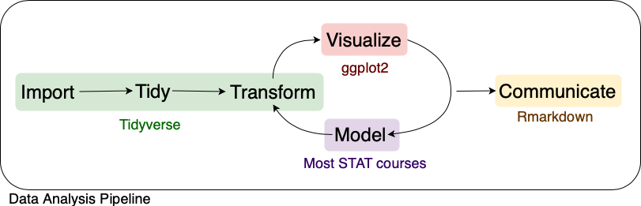

```{r echo = FALSE, message = FALSE}
knitr::opts_chunk$set(fig.height = 3)
```


We will be using the `ggplot2` package for making graphics in this class.

The first time on your machine you’ll need to install the package:

```{r eval = FALSE}
install.packages("ggplot2")
```

Whenever you first want to plot during an `R` session, we need to load the library. 

```{r}
library(ggplot2)
```

## Why visualize?

The sole purpose of visualization is communication. Visualization offers an alternative way of communicating numbers than simply using tables. Often, we can get more information out of our numbers graphically than with numerical summaries alone. Through the use of [exploratory data analysis]{.red}, we can see what the data can tell us beyond the formal modeling or hypothesis testing task.

For example, let's look at the following dataset.

```{r}
anscombe
```

Anscombe's Quartet is comprised of 4 datasets that have nearly identical simple statistical properties. Each dataset contains 11 (x, y) points with the same mean, median, standard deviation, and correlation coefficient between x and y.

```{r, echo=FALSE, message = FALSE, warning = FALSE}
library(dplyr)
library(tidyr)

anscombe |>
  gather(variable, value) |>
  separate(variable, into = c("variable", "dataset"), sep = 1) |>
  group_by(variable, dataset) |>
  mutate(id = 1:n()) |>
  spread(variable, value) |>
  group_by(dataset) |>
  summarise(mean_x = mean(x), sd_x = sd(x),
            mean_y = mean(y), sd_y = sd(y),
            cor = cor(x, y)) |>
  knitr::kable()
```

But this doesn't tell the whole story. Let's look closer at these datasets.

```{r, echo=FALSE}
anscombe |>
  gather(variable, value) |>
  separate(variable, into = c("variable", "dataset"), sep = 1) |>
  group_by(variable, dataset) |>
  mutate(id = 1:n()) |>
  spread(variable, value) |>
  ggplot() +
  geom_point(aes(x, y)) +
  geom_smooth(aes(x, y), method = "lm", se = FALSE) +
  facet_wrap(.~dataset)
```

Visualizations can aid communication and make the data easier to perceive. It can also show us things about our data that numerical summaries won't necessarily capture.

## A Grammar of Graphics

The grammar of graphics was developed by Leland Wilkinson (https://www.springer.com/gp/book/9780387245447). It is a set of grammatical rules for creating perceivable graphs. Rather than thinking about a limited set of graphs, we can think about graphical forms. This abstraction makes thinking, creating, and communicating graphics easier.

Statistical graphic specifications are expressed using the following components.

1. **data**: a set of data operations that create variables from datasets
2. **trans**: variable transformations
3. **scale**: scale transformations
4. **coord**: a coordinate system
5. **element**: graphs (points) and their aesthetic attributes (color)
6. **guide**: one or more guides (axes, legends, etc.)

`ggplot2` is a package written by Hadley Wickham (https://vita.had.co.nz/papers/layered-grammar.html) that implements the ideas in the grammar of graphics to create layered plots.

`ggplot2` uses the idea that you can build every graph with graphical components from three sources

1. the data, represented by `geom`s
2. the scales and coordinate system
3. the plot annotations 

This works by mapping values in the data to visual properties of the geom (aesthetics) like size, color, and locations.

Let's build a graphic. We start with the data. We will use the `diamonds` dataset, and we want to explore the relationship between carat and price.

```{r}
head(diamonds)
ggplot(data = diamonds)
```

Next we need to specify the aesthetic (variable) mappings.

```{r}
ggplot(data = diamonds, mapping = aes(carat, price))
```

Now we choose a geom to display our data.

```{r}
ggplot(data = diamonds, mapping = aes(carat, price)) +
  geom_point()
```

And add an aesthetic to our plot.

```{r}
ggplot(data = diamonds, mapping = aes(carat, price)) +
  geom_point(aes(color = cut))
```

We could add another layer.

```{r}
ggplot(data = diamonds, mapping = aes(carat, price)) +
  geom_point(aes(color = cut)) +
  geom_smooth(aes(color = cut), method = "lm")
```

And finally, we can specify coordinate transformations.

```{r}
ggplot(data = diamonds, mapping = aes(carat, price)) +
  geom_point(aes(color = cut)) +
  geom_smooth(aes(color = cut), method = "lm") +
  scale_y_sqrt()
  
```

Notice we can add on to our plot in a layered fashion.

## Graphical Summaries

There are some basic charts we will use in this class that cover a wide range of cases. For univariate data, we can use dotplots, histograms, and barcharts. For two dimensional data, we can look at scatterplots and boxplots.

### Scatterplots

Scatterplots are used for investigating relationships between two numeric variables. To demonstrate some of the flexibility of scatterplots in `ggplot2`, let's answer the following question.

> Do cars with big engines use more fuel than cars with small engines?

We will use the `mpg` dataset in the `ggplot2` package to answer the question. This dataset contains observations collected by the US Environmental Protection Agency on `r length(unique(mpg$model))` models of car.

```{r}
dim(mpg)
summary(mpg)
head(mpg)
```

`mpg` contains the following variables: `displ`, a car’s engine size, in liters, and `hwy`, a car’s fuel efficiency on the highway, in miles per gallon (mpg).

```{r}
ggplot(data = mpg) +
  geom_point(mapping = aes(displ, hwy))
```

So we can say, yes, cars with larger engines have worse fuel efficiency. But there is more going on here.

```{r echo = FALSE}
mpg |>
  mutate(outlier = displ > 5 & hwy > 20) |>
  ggplot() +
  geom_point(mapping = aes(displ, hwy, colour = outlier, size = outlier)) +
  scale_color_manual(values = c("black", "red")) +
  scale_size_manual(values = 1:2) +
  theme(legend.position = "none")


```

The red points above seem to have higher `mpg` than they should based on engine size alone (outliers). Maybe there is a confounding variable we've missed. The `class` variable of the mpg dataset classifies cars into groups such as compact, midsize, and SUV.

```{r}
ggplot(data = mpg) +
  geom_point(mapping = aes(displ, hwy, colour = class))
```

The colors show that many of the unusual points are two-seater cars, probably sports cars! Sports cars have large engines like SUVs and pickup trucks, but small bodies like midsize and compact cars, which improves their gas mileage.

Instead of color, we could also map a categorical variable (like `class`) to shape, size, and transparency (`alpha`).

So far we have mapped aesthetics to variables in our dataset. What happens if we just want to generally change the aesthetics of our plots, without tying that to data? We can specify general aesthetics as parameters of the `geom`, instead of specifying them as aesthetics (`aes`).

```{r}
ggplot(data = mpg) +
  geom_point(mapping = aes(displ, hwy), colour = "darkgreen", size = 2)
```

When interpreting a scatterplot we can look for big patterns in our data, as well as form, direction, and strength of relationships. Additionally, we can see small patterns and deviations from those patterns (outliers).


### Histograms, Barcharts, and Boxplots

We can look at the distribution of continuous variables using **histograms** and **boxplots** and the distribution of discrete variables using **barcharts**.

```{r}
ggplot(data = mpg) +
  geom_histogram(mapping = aes(hwy), bins = 30) 
## histograms will look very different sometimes with different binwidths

ggplot(data = mpg) +
  geom_boxplot(mapping = aes(drv, hwy)) 
## boxplots allow us to see the distribution of a cts rv conditional on a discrete one
## we can also show the actual data at the same time
ggplot(data = mpg) +
  geom_boxplot(mapping = aes(drv, hwy)) +
  geom_jitter(mapping = aes(drv, hwy), alpha = .5)

ggplot(data = mpg) +
  geom_bar(mapping = aes(drv)) 
## shows us the distribution of a categorical variable
```

### Facets

So far we've looked at 

1. how one (or more) variables are distributed - barchart or histogram
2. how two variables are related - scatterplot, boxplot
3. how two variables are related, conditioned on other variables - color

Sometimes color isn't enough to show conditioning because of crowded plots.

```{r}
ggplot(data = diamonds, mapping = aes(carat, price)) +
  geom_point(aes(color = cut))
```

When this is the case, we can *facet* to display plots for different subsets. To do this, we specify row variables ~ column variables (or . for none).

```{r}
ggplot(data = diamonds, mapping = aes(carat, price)) +
  geom_point(aes(color = cut)) +
  facet_wrap(. ~ cut)
```

If instead we have two variables we want to facet by, we can use `facet_grid()`.

```{r, fig.height=6}
ggplot(data = diamonds, mapping = aes(carat, price)) +
  geom_point(aes(color = cut)) +
  facet_grid(color ~ cut)
```

## Additional resources

Documentation and cheat sheets (https://ggplot2.tidyverse.org)

Book website (http://had.co.nz/ggplot2/)

Ch. 3 of R4DS (https://r4ds.had.co.nz/data-visualisation.html)

# tidyverse

The tidyverse is a suite of packages released by RStudio that work very well together ("verse") to make data analysis run smoothly ("tidy"). It's also a package in `R` that loads all the packages in the tidyverse at once.

```{r, eval=FALSE}
library(tidyverse)
```

You actually already know one member of the tidyverse -- `ggplot2`! We will highlight three more packages in the tidyverse for data analysis.



## `readr`

The first step in (almost) any data analysis task is reading data into `R`. Data can take many formats, but we will focus on text files.

> But what about `.xlsx`??

File extensions `.xls` and `.xlsx` are proprietary Excel formats/ These are binary files (meaning if you open one outside of Excel it will not be human readable). An alternable for rectangular data is a `.csv`.

`.csv` is an extension for *comma separated value* files. They are text files -- directly readable -- where each column is separated by a comma and each row a new line.

```
Rank,Major_code,Major,Total,Men,Women,Major_category,ShareWomen
1,2419,PETROLEUM ENGINEERING,2339,2057,282,Engineering,0.120564344
2,2416,MINING AND MINERAL ENGINEERING,756,679,77,Engineering,0.101851852
```

`.tsv` is an extension for *tab separated value* files. These are also text files, but the columns are separated by tabs instead of commas. Sometimes these will be `.txt` extension files.

```
Rank    Major_code    Major    Total    Men    Women    Major_category    ShareWomen
1    2419    PETROLEUM ENGINEERING    2339    2057    282    Engineering    0.120564344
2    2416    MINING AND MINERAL ENGINEERING    756    679    77    Engineering    0.101851852
```

The package `readr` provides a fast and friendly way to ready rectangular text data into `R`.

Here is an example csv file from fivethirtyeight.com on how to choose your college major (https://fivethirtyeight.com/features/the-economic-guide-to-picking-a-college-major/).

```{r}
# load readr
library(readr)

# read a csv
recent_grads <- read_csv(file = "https://raw.githubusercontent.com/fivethirtyeight/data/master/college-majors/recent-grads.csv")
```

`read_csv()` is just one way to read a file using the `readr` package.

- `read_delim()`: the most generic function. Use the delim argument to read a file with any type of delimiter
- `read_tsv()`: read tab separated files
- `read_lines()`: read a file into a vector that has one element per line of the file
- `read_file()`: read a file into a single character element
- `read_table()`: read a file separated by space

## `dplyr`

We almost never will read in data and have it in exactly the right form for visualizing and modeling. Often we need to create variable or summaries.

To facilitate easy transformation of data, we're going to learn how to use the `dplyr` package. `dplyr` uses 6 main verbs, which correspond to some main tasks we may want to perform in an analysis. 

We will do this with the `recent_grads` data from fivethiryeight.com we just read into `R` using `readr`.

### `|>`

Before we get into the verbs in `dplyr`, I want to introduce a new paradigm. All of the functions in the tidyverse are structured such that the first argument is a data frame and they also return a data frame. This allows for efficient use of the pipe operator `|>` (pronounce this as "then").

```{r, eval=FALSE}
a |> b()
```

Taked the result on the left and passes it to the first argument on the right. This is equivalent to

```{r, eval=FALSE}
b(a)
```

This is useful when we want to chain together many operations in an analysis.

### `filter()`

`filter()` lets us subset observations based on their values. This is similar to using `[]` to subset a data frame, but simpler.

The first argument is the name of the data frame. The second and subsequent arguments are the expressions that filter the data frame. 

Let's subset the `recent_grad` data set to focus on Statistics majors.

```{r}
recent_grads |> filter(Major == "STATISTICS AND DECISION SCIENCE")
```

Alternatively, we could look at all Majors in the same category, "Computers & Mathematics", for comparison.

```{r}
recent_grads |> filter(Major_category == "Computers & Mathematics")
```

Notice we are using `|>` to pass the data frame to the first argument in `filter()` and we do not need to use `recent_grads$Colum Name` to subset our data.

`dplyr` functions never modify their inputs, so if we need to save the result, we have to do it using `<-`.

```{r}
math_grads <- recent_grads |> filter(Major_category == "Computers & Mathematics")
```

Everything we've already learned about logicals and comparisons comes in handy here, since the second argument of `filter()` is a comparitor expression telling `dplyr` what rows we care about.

### `arrange()`

`arrange()` works similarly to `filter()` except that it changes the order of rows rather than subsetting. Again, the first parameter is a data frame and the additional parameters are a set of column names to order by. 

```{r}
math_grads |> arrange(ShareWomen)
```

If we provide more than one column name, each additional column will be used to break ties in the values of preceding columns.

We can use `desc()` to re-order by a column in descending order.

```{r}
math_grads |> arrange(desc(ShareWomen))
```

### `select()`

Sometimes we have data sets with a ton of variables and often we want to narrow down the ones that we actually care about. `select()` allows us to do this based on the names of the variables.

```{r}
math_grads |> select(Major, ShareWomen, Total, Full_time, P75th)
```

We can also use 

- `:` to select all columns between two columns
- `-` to select all columns except those specified
- `starts_with("abc")` matches names that begin with "abc"
- `ends_with("xyz")` matches names that end with "xyz"
- `contains("ijk")` matches names that contain "ijk"
- `everything()` mathes all columns

```{r}
math_grads |> select(Major, College_jobs:Low_wage_jobs)
```

`rename()` is a function that will rename an existing column and select all columns.

```{r}
math_grads |> rename(Code_major = Major_code)
```

### `mutate()`

Besides selecting sets of existing columns, we can also add new columns that are functions of existing columns with `mutate()`. `mutate()` always adds new columns at the end of the data frame.

```{r}
math_grads |> mutate(Full_time_rate = Full_time_year_round/Total)

# we can't see everything
math_grads |> 
  mutate(Full_time_rate = Full_time_year_round/Total) |> 
  select(Major, ShareWomen, Full_time_rate)
```

### `summarise()`

The last major verb is summarise(). It collapses a data frame to a single row based on a summary function.

```{r}
math_grads |> summarise(mean_major_size = mean(Total))
```

A useful summary function is a count (`n()`), or a count of non-missing values (`sum(!is.na())`).

```{r}
math_grads |> summarise(mean_major_size = mean(Total), num_majors = n())
```

### `group_by()`

`summarise()` is not super useful unless we pair it with `group_by()`. This changes the unit of analysis from the complete dataset to individual groups. Then, when we use the `dplyr` verbs on a grouped data frame they'll be automatically applied "by group".

```{r}
recent_grads |>
  group_by(Major_category) |>
  summarise(mean_major_size = mean(Total, na.rm = TRUE)) |>
  arrange(desc(mean_major_size))
```

We can group by multiple variables and if we need to remove grouping, and return to operations on ungrouped data, we use `ungroup()`.

Grouping is also useful for `arrange()` and `mutate()` within groups.

## `tidyr`

 > "Happy families are all alike; every unhappy family is unhappy in its own way." –– Leo Tolstoy

> "Tidy datasets are all alike, but every messy dataset is messy in its own way." –– Hadley Wickham

*Tidy data* is an organization strategy for data that makes it easier to work with, analyze, and visualize. `tidyr` is a package that can help us tidy our data in a less painful way.

The following all contain the same data, but show different levels of "tidiness".

```{r}
table1

table2

table3

# spread across two data frames
table4a

table4b
```

While these are all representations of the same underlying data, they are not equally easy to use. 

There are three interrelated rules which make a dataset tidy:

1. Each variable must have its own column.
2. Each observation must have its own row.
3. Each value must have its own cell.

In the above example, 

`table2` isn't tidy because each variable doesn't have its own column.

`table3` isn't tidy because each value doesn't have its own cell.

`table4a` and `table4b` aren't tidy because each observation doesn't have its own row.

[`table1` is tidy!]{.red}

Being tidy with our data is useful because it's a consistent set of rules to follow for working with data and because it allows `R` to be efficient.

```{r}
# Compute rate per 10,000
table1 |> 
  mutate(rate = cases / population * 10000)

# Visualize cases over time
library(ggplot2)
ggplot(table1, aes(year, cases)) + 
  geom_line(aes(group = country)) + 
  geom_point(aes(colour = country))
```

### Pivoting

Unfortunately, most of the data you will find in the "wild" is not tidy. So, we need tools to help us tidy unruly data.

The main tools in `tidyr` are the ideas of `pivot_longer()` and `pivot_wider()`. As the names imply, `pivot_longer()` "lengthens" our data, increasing the number of rows and decreasing the number of columns. `pivot_wider` does the opposite, increasing the number of columns and decreasing the number of rows.

These two functions resolve one of two common problems:

1. One variable might be spread across multiple columns. (`pivot_longer()`)
2. One observation might be scattered across multiple rows. (`pivot_wider()`)

A common issue with data is when values are used as column names.

```{r}
table4a
```

We can fix this using `pivot_longer()`.

```{r, eval=FALSE}
table4a |>
  pivot_longer(-country, names_to = "year", values_to = "cases")
```

Notice we specified with columns we wanted to consolidate by telling the function the column we *didn't* want to change (`-country`). We can use the `dplyr::select()` syntax here for specifying the columns to pivot.

We can do the same thing with `table4b` and then **join** the databases together by specifying unique identifying attributes.

```{r, eval=FALSE}
table4a |>
  pivot_longer(-country, names_to = "year", values_to = "cases") |>
  left_join(table4b |> pivot_longer(-country, names_to = "year", values_to = "population"))
```

If, instead, variables don't have their own column, we can `pivot_wider()`.

```{r, eval=FALSE}
table2

table2 |>
  pivot_wider(names_from = type, values_from = count)
```


### Separating and Uniting

So far we have tidied `table2` and `table4a` and `table4b`, but what about `table3`?

```{r}
table3
```

We need to split the `rate` column into the cases and population columns so that each value has its own cell. The function we will use is `separate()`. We need to specify the column, the value to split on ("/"), and the names of the new coumns.

```{r}
table3 |>
  separate(rate, into = c("cases", "population"), sep = "/")
```

By default, `separate()` will split values wherever it sees a character that isn't a number or letter.

`unite()` is the opposite of `separate()` -- it combines multiple columns into a single column.


## Additional resources

`readr` (https://readr.tidyverse.org)

`dplyr` (https://dplyr.tidyverse.org)

`tidyr` (https://tidyr.tidyverse.org)

