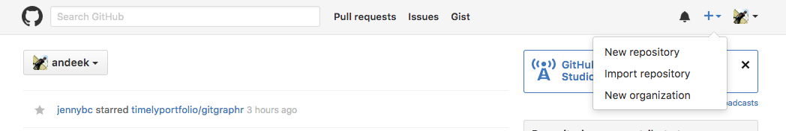
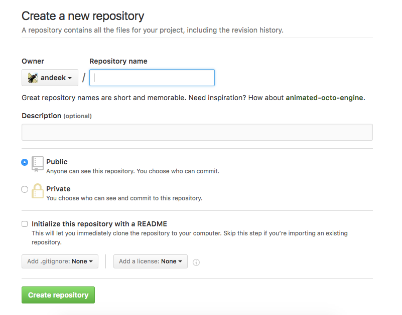
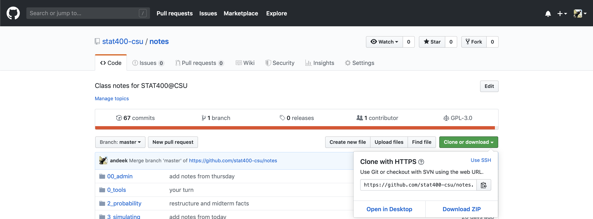
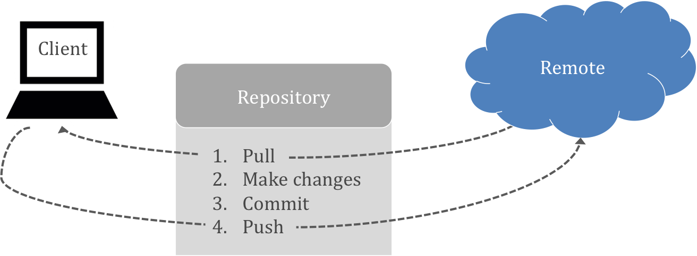
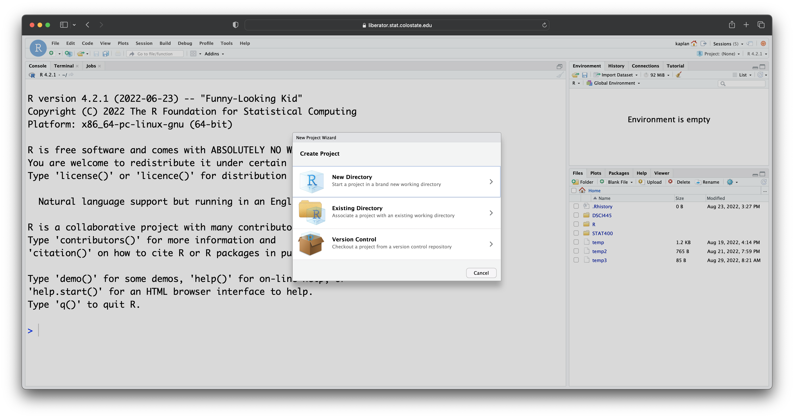
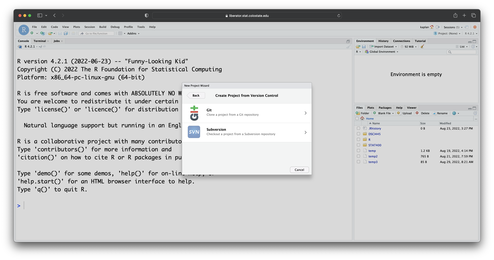
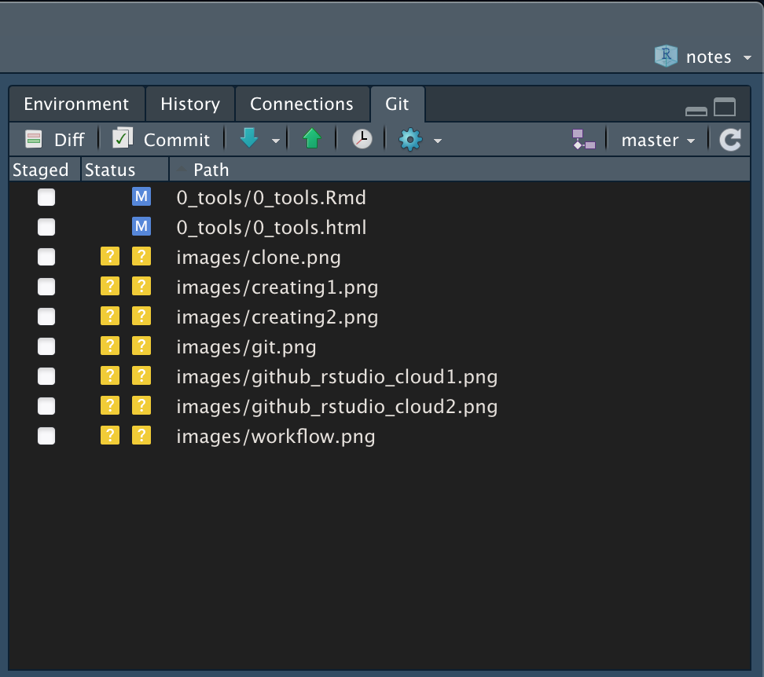

```{r echo = FALSE, message = FALSE}
knitr::opts_chunk$set(fig.height = 3)
```


**Note:** Thanks to http://happygitwithr.com for inspiration and material. 

## Definition/background

**Git** is a version control system that was created to help developers manage collaborative software projects. Git tracks the evolution of a set of files, called a **repository** or **repo**. 

[ ]{.pagebreak}

This helps us

- *merge* conflicts that arrise from collaboration
- *rollback* to previous versions of files as necessary
- store *master* versions of files, no more `paper_final_final_I_really_mean_it.docx`

```{r, out.width = "75%", echo = FALSE}
knitr::include_graphics("http://www.phdcomics.com/comics/archive/phd101212s.gif")
```

[](http://phdcomics.com/comics/archive.php?comicid=1531)

## Terminology

- **Repository:** The most basic element of git, imagine as a project's folder. A repository contains all of the project files, and stores each file's revision history. Can be either public or private.
- **Clone:** A copy of a repository that lives on your computer instead of on a website's server somewhere, or the act of making that copy.
- **Pull:** When you are fetching in changes and merging them. 
- **Commit:** An individual change to a file (or set of files). Every time you save it creates a unique ID that allows you to keep record of what changes were made when and by who.
- **Push:** Sending your committed changes to a remote repository such as GitHub.com.
- **Fork:** A fork is a personal copy of another user's repository that lives on your account. Forks allow you to freely make changes to a project without affecting the original. 
- **Pull Request:** Proposed changes to a repository submitted by a user and accepted or rejected by a repository's collaborators.
- **Issue:** Issues are suggested improvements, tasks or questions related to the repository. 
- **Remote:** This is the version of something that is hosted on a server, most likely GitHub.com. It can be connected to local clones so that changes can be synced.

From https://help.github.com/articles/github-glossary/.

## GitHub 

There are many hosting services for remote repositories ([GitHub](github.com), [Bitbucket](bitbucket.org), [GitLab](about.gitlab.com), etc.). We will use GitHub in this class, but the ideas carry over to the other services.

By default, all materials on GitHub are **public**. This is *good* because you are getting your work out there and contributing to the open source community! 

If you need **private** repos, checkout [GitHub for Education](https://education.github.com/) - free private repos for students/postdocs/professors.

## Creating Repos

1. 
2. 

Initialize readme (yes), .gitignore (`R` usually), license (e.g. GPL 3)

[ ]{.pagebreak}

[**Your Turn**]{.yourturn}

1. Create a GitHub account

    - [github.com](http://github.com) 
    
    - Consider your username, want to be identifiable, professional and probably include your actual name. Do you have other handles? Twitter?
    
    - Don't worry about paying for a plan now, stick with the free one.
    
1. Create a `hello-world` repo


[ ]{.pagebreak}

Cloning a repo --



From scratch:

1. Create the repo on the GitHub website

1. Clone the repo

1. Start working

1. Add files, commit, push, etc.

From existing folder:

1. Create the repo on the GitHub website

1. Clone the repo

1. Copy existing work into local folder

1. Add files, commit, push, etc.


## Pushing and pulling, a tug of war



**Important:** remember to pull before you start working to get the most up to date changes from your collaborators (or your past self) before making local changes!


## When should I commit?

Think of commits as a checkpoint in a video game. This is a point in time when you want to save your status so that you can come back to it later if need be.

> Commits are like voting. I like to do it early and often.

*- Me, right now*


## Blow it up

Sometimes your local repo gets borked. That's OK. There are ways that we can work really hard and fix them, but sometimes you just want to stash your files somewhere and re-clone from your centralized repository.

## Git with RStudio

Rstudio.cloud allows you to make projects based on GitHub repos.






Local RStudio works much the same way, with the ability to push/pull from a local project to a GitHub repo.



By letting us 

1. Select files to commit.
2. Commit
3. Push/Pull

[ ]{.pagebreak}

## Collaboration

In this class, we will have a collaborative project. It will be hosted on GitHub and part of your grade will be how well you collaborate through the use of GitHub. For this, we will need to have project repos that everyone can push to!

GitHub Repo site (https://github.com/username/reponame) > Settings > Collaborators & Teams > Collaborators > Add collaborator

Your collaborators will have a lot of power in your repo, so choose wisely! They can change anything in the repo and add their own files. They can also delete your files! The only thing they can't do is delete the repo, add collaborators, or change other settings for the repo. 

## Installation help

We are not covering installation on your personal computers for this class. If you would like to work through it on your own, here is an *excellent* guide: http://happygitwithr.com/installation-pain.html

Feel free to come to office hours or setup individual time with us if you need help.

[ ]{.pagebreak}

[**Your Turn**]{.yourturn}

1. Edit the README file in your `hello-world` repo

1. Commit and push changes

1. Check out your commit history!

1. Add me (`andeek`) as a collaborator to your hello-world repo


