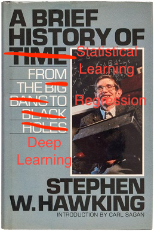

```{r echo = FALSE, message = FALSE}
library(tidyverse)
library(scales)
library(ISLR)
library(knitr)

opts_chunk$set(fig.height = 3, message = FALSE, warning = FALSE)
theme_set(theme_bw())
```

*Statistical learning* refers to a vast set of tools for understanding data.
<br/><br/>


https://xkcd.com/2341/

**Alternative text:** I vaguely and irrationally resent how useful WebPlotDigitizer is.

These tools can broadly be thought of as 

<br/><br/><br/><br/><br/><br/><br/><br/><br/><br/><br/>

Examples:

**Wage data**

```{r, echo = FALSE}
head(Wage, 3) %>% kable(row.names = FALSE) # look at the data
```

Factors related to wages for a group of males from the Atlantic region of the United States. We might be interested in the association between an employee's `age`, `education`, and the calendar `year` on his `wage`. 

<br/>

```{r, echo = FALSE, fig.show='hold', out.width='33%', fig.height = 9}
ggplot(Wage) +
  geom_point(aes(age, wage), alpha = 0.5) + 
  geom_smooth(aes(age, wage)) +
  theme(text = element_text(size=40))

ggplot(Wage) +
  geom_point(aes(year, wage), alpha = 0.5) + 
  theme(text = element_text(size=40))

ggplot(Wage) +
  geom_boxplot(aes(education, wage)) + 
  theme(text = element_text(size=40),
        axis.text.x = element_text(angle=90, hjust=1))
```

<br/><br/><br/>

**Gene Expression Data**

Consider the `NCI60` data, which consists of `r comma(ncol(NCI60$data))` gene expression measurements for `r comma(nrow(NCI60$data))` cancer lines. We are interested ind determining whether there are **groups** among the cell lines based on their gene expression measurements.

```{r, echo = FALSE}
#principal components
# create new data frame with centered variables
scaled_df <- apply(NCI60$data, 2, scale)
gene_cov <- cov(t(scaled_df))
gene_eigen <- eigen(gene_cov)

phi <- data.frame(gene_eigen$vectors[, 1:2])

ggplot(phi) +
  geom_point(aes(X1, X2))

ggplot(phi) +
  geom_point(aes(X1, X2, colour = NCI60$labs)) +
  theme(legend.position = "bottom")
```

# A Brief History



Although the term "statistical machine learning" is fairly new, many of the concepts are not. Here are some highlights:


# Notation and Simple Matrix Algebra

I'll try to keep things consistent notationally throughout this course. Please call me out if I don't!

$n$

<br/><br/>

$p$

<br/><br/>

$x_{ij}$

<br/><br/>

$\boldsymbol X$

<br/><br/>

$\boldsymbol y$

<br/><br/>

$a, \boldsymbol A, A$

<br/><br/>

$a \in \mathbb{R}$

<br/><br/>

Matrix multiplication

