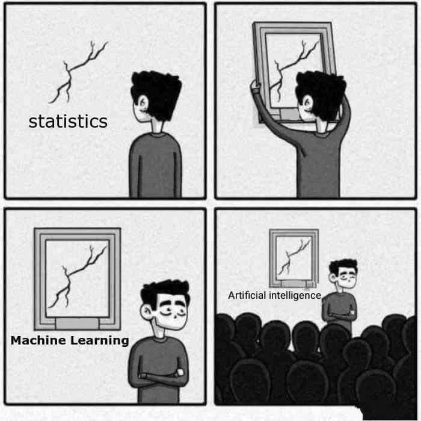

```{r echo = FALSE, message = FALSE}
library(tidyverse)
library(scales)
library(ISLR)
library(knitr)

opts_chunk$set(fig.height = 3, message = FALSE, warning = FALSE)
theme_set(theme_bw())
```



Credit: https://www.instagram.com/sandserifcomics/


# What is Statistical Learning?

A scenario: We are consultants hired by a client to provide advice on how to improve sales of a product.

```{r, echo = FALSE}
ads <- read_csv("data/Advertising.csv")
ads %>% select(-1) %>% head(4) %>% kable()
```


We have the advertising budgets for that product in `r nrow(ads)` markets and the sales in those markets. It is not possible to increase sales directly, but the client can change how they budget for advertising. **How should we advise our client?**

```{r, echo = FALSE}
ads %>% 
  select(-1) %>%
  gather(type, budget, -sales) %>%
  ggplot() +
  geom_point(aes(budget, sales), alpha = .5) +
  geom_smooth(aes(budget, sales), method = "lm") +
  facet_wrap(.~type, scales = "free_x")

```

**input variables**

<br/><br/><br/>

**output variable**

<br/><br/><br/>

More generally --

<br/><br/><br/><br/><br/><br/>

$$
Y = f(X) + e.
$$

<br/><br/><br/>

Essentially, *statistical learning* is a set of approaches for estimating $f$.

## Why estimate $f$?

There are two main reasons we may wish to estimate $f$.

**Prediction**

In many cases, inputs $X$ are readily available, but the output $Y$ cannot be readily obtained (or is expensive to obtain). In this case, we can predict $Y$ using

$$
\hat{Y} = \qquad \qquad
$$

In this case, $\hat{f}$ is often treated as a "black box", i.e. we don't care much about it as long as it yields accurate predictions for $Y$.

The accuracy of $\hat{Y}$ in predicting $Y$ depends on two quantities, *reducible* and *irreducible* error.

\pagebreak

We will focus on techniques to estimate $f$ with the aim of reducing the reducible error. It is important to remember that the irreducible error will always be there and gives an upper bound on our accuracy.

**Inference**

Sometimes we are interested in understanding the way $Y$ is affected as $X_1, \dots, X_p$ change. We want to estimate $f$, but our goal isn't to necessarily predict $Y$. Instead we want to understand the relationship between $X$ and $Y$.


<br/>

We may be interested in the following questions:

1. <br/><br/><br/>

2. <br/><br/><br/>

3. <br/><br/><br/>

To return to our advertising data,


<br/><br/><br/><br/><br/><br/><br/><br/><br/><br/><br/>

Depending on our goals, different statistical learning methods may be more attractive.

\pagebreak

## How do we estimate $f$?

**Goal:**

<br/><br/><br/>

In other words, find a function $\hat{f}$ such that $Y \approx \hat{f}(X)$ for any observation $(X,Y)$. We can characterize this task as either *parametric* or *non-parametric*

**Parametric**

1. <br/><br/><br/><br/><br/><br/>

2. <br/><br/><br/><br/><br/><br/>

This approach reduced the problem of estimating $f$ down to estimating a set of *parameters*.

Why?

\pagebreak

**Non-parametric**

Non-parametric methods do not make explicit assumptions about the functional form of $f$. Instead we seek an estimate of $f$ tht is as close to the data as possible without being too wiggly.

Why?

\pagebreak


## Prediction Accuracy and Interpretability


Of the many methods we talk about in this class, some are less flexible -- they produce a small range of shapes to estimate $f$. 

Why would we choose a less flexible model over a more flexible one?


# Supervised vs. Unsupervised Learning

Most statistical learning problems are either *supervised* or *unsupervised* -- 

\pagebreak

What's possible when we don't have a response variable?

- We can seek to understand the relatopnships between the variables, or

- We can seek to understand the relationships between the observations.

<br/><br/><br/><br/><br/>

```{r, echo = FALSE, out.width="50%", fig.height=6, fig.show="hold"}
library(MASS)

easy_clust <- data.frame(mvrnorm(30, mu = c(2, 10), Sigma = matrix(c(1, .5, .5, 1), nrow = 2, byrow = TRUE)), group = rep("1", 30)) %>%
  bind_rows(data.frame(mvrnorm(30, mu = c(2, 2), Sigma = matrix(c(1, .5, .5, 1), nrow = 2, byrow = TRUE)), group = rep("2", 30))) %>%
  bind_rows(data.frame(mvrnorm(30, mu = c(10, 6), Sigma = matrix(c(1, .3, .3, 1), nrow = 2, byrow = TRUE)), group = rep("3", 30)))

hard_clust <- data.frame(mvrnorm(30, mu = c(2, 6), Sigma = matrix(c(1, .3, .3, 1), nrow = 2, byrow = TRUE)), group = rep("1", 30)) %>%
  bind_rows(data.frame(mvrnorm(30, mu = c(2, 2), Sigma = matrix(c(1, .3, .3, 1), nrow = 2, byrow = TRUE)), group = rep("2", 30))) %>%
  bind_rows(data.frame(mvrnorm(30, mu = c(4, 4), Sigma = matrix(c(1, .2, .2, 1), nrow = 2, byrow = TRUE)), group = rep("3", 30)))

ggplot(easy_clust) +
  geom_point(aes(X1, X2, colour = group, shape = group), size = 4) +
  theme(legend.position = "none", text = element_text(size=30))

ggplot(hard_clust) +
  geom_point(aes(X1, X2, colour = group, shape = group), size = 4) +
  theme(legend.position = "none", text = element_text(size=30))

```

<br/><br/><br/><br/><br/><br/><br/>

Sometimes it is not so clear whether we are in a supervised or unsupervised problem. For example, we may have $m < n$ observations with a response measurement and $n-m$ observations with no response. Why?

<br/>

In this case, we want a method that can incorporate all the information we have.

# Regression vs. Classification

Variables can be either quantitative or categorical. 

<br/><br/>

Examples -- 

Age 

<br/>

Height

<br/>

Income

<br/>

Price of stock

<br/>

Brand of product purchased

<br/>

Cancer diagnosis

<br/>

Color of cat

<br/>

We tend to select statistical learning methods for supervised problems based on whether the response is quantitative or categorical. 

<br/>

However, when the predictors are quantitative or categorical is less important for this choice.